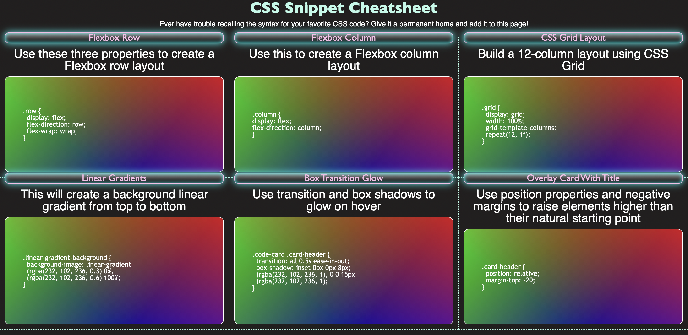

#  CSS Cheat Sheet

## Description

- CSS Cheat Sheet mini project for HTML and CSS practice
- This project was aimed at reconstructing a page form scratch
- Provides some useful tips on CSS techniques
- Gained a better understanding on Flexbox and media queries
-
## Table of Contents

- [Installation](#installation)
- [Usage](#usage)
- [Technologies](#technologies)
- [Screenshots](#screenshots)
- [Credits](#credits)
- [License](#license)

## Installation
N/A

## Technologies
- HTML 
- CSS

## Usage
Webpage available here:
https://jminaga.github.io/css_cheat_sheet/index.html
## Screenshots

## Credits
Denver University Full-Stack Web Development Bootcamp

## license
N/A